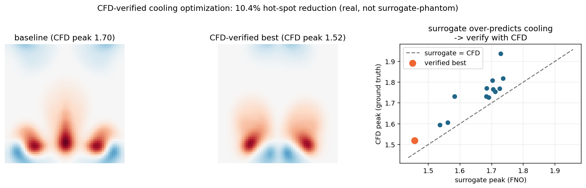

# Data-Center Cooling Design with Fourier Neural Operators

**Where should the cold-air vents go?** A GPU spectral CFD solver → a Fourier Neural Operator surrogate → a differentiable layout optimizer — with every proposed design checked against the ground-truth solver.


*Hot air (red) rises off the fixed racks; cold air (blue) pools over the cold-aisle vents — a 2D Boussinesq simulation, learned by an FNO and used for design optimization.*

<sub>Python 3.10 · PyTorch 2.5 (CUDA 12.1) · NVIDIA PhysicsNeMo 1.3 · single GPU (RTX 4050, 6 GB)</sub>

---

## Objective

Racks are bolted to the floor. The cooling is what you actually get to place. So:

> **Given a fixed rack layout, where do you put the cold-air vents to minimize the hottest temperature in the room?**

Answering that with CFD alone means one solver run per candidate layout — too slow to search, and not differentiable, so there's no gradient to follow. This repo builds the alternative:

**train a neural operator to stand in for the solver → differentiate through it to propose layouts → hand every proposal back to the real solver for verification.**

That last step is the point. A surrogate optimized against itself produces numbers that evaporate under real physics; this pipeline reports only what the ground-truth solver confirms.

---

## Results at a glance

| | |
|---|---|
| **CFD-verified hot-spot reduction** | **10.4%** — peak temperature 1.698 → 1.520, re-simulated with the real solver |
| Naive surrogate-only optimization | predicted 15.7%, verified at only **2.8%** — the optimizer's curse, caught |
| Reproduced on NVIDIA PhysicsNeMo | **10.4%** — a parameter-matched port lands on the *identical* verified optimum |
| Operator accuracy (2D Navier–Stokes) | one-step relative L2 **0.24%** |

---

## Pipeline

| Stage | What it does | Result |
|---|---|---|
| **1. Spectral CFD solver** | GPU pseudo-spectral solver (2D Navier–Stokes → Boussinesq → data-center cooling) generates training data | ~2 min for 200 trajectories on GPU |
| **2. Neural operator** | An FNO learns the PDE solution operator (built from scratch — spectral convolutions, the works) | one-step rel-L2 **0.24%** (Navier–Stokes) |
| **3. Rollout** | Autoregressive closed-loop prediction; honest error-vs-time analysis | stable for the forced case; chaotic drift diagnosed for the free case |
| **4. Design optimization** | Backprop a temperature objective through the differentiable FNO, then **verify candidates against ground-truth CFD** (surrogate proposes → solver checks → keep verified-best) | **10.4% CFD-verified** hot-spot reduction |
| **5. PhysicsNeMo port** | The same operator rebuilt on NVIDIA's `physicsnemo.models.fno.FNO` with `DistributedManager`, run through the full design loop | parameter-matched, independently reproduces the optimum at **10.4%** |

The final artifact is a **differentiable design tool**: given a room, it finds where to place cooling so the racks stay cool — the "run more simulations, pull design insight out" pitch, made concrete.

---

## Highlights

- **Built the FNO from scratch** — spectral convolution, mode truncation, the lift/project structure — no `neuraloperator` black box.
- **GPU pseudo-spectral solver** for 2D incompressible Navier–Stokes (vorticity form) and Boussinesq convection, ~20–40× faster than the NumPy version.
- **Multi-field, conditioned operator**: predicts coupled `(vorticity, temperature)` and conditions on a **rack/vent layout map** fed as an input channel.
- **Differentiable inverse design**: gradient descent (with multi-start) through the trained FNO to optimize cooling layout.
- **CFD-verified optimization loop**: the surrogate proposes, the real solver verifies, the verified-best is kept — recovering a *genuine* **10.4%** reduction where naive surrogate-only optimization over-promised (15.7% predicted → **2.8% real**). Exposes and defeats the "optimizer's curse."
- **Ported to NVIDIA PhysicsNeMo (Modulus)** — same operator on their API, `DistributedManager` multi-GPU, and at **matched parameter count** it independently reproduces the verified optimum exactly.
- Honest evaluation throughout — including a diagnosed **chaotic rollout divergence** and how it was worked around.

---

## Results in pictures

**Neural operator matches the solver** (2D Navier–Stokes, autoregressive rollout — truth top, FNO bottom):


**Rack-placement optimization** — clustered racks make one merged hot spot; the optimizer spreads them (peak −11.5%):


**Cold-vent placement optimization** (the realistic case — racks are fixed, optimize the cooling):


**CFD-verified optimization** — surrogate optimization over-promises (the raw 15.7% verifies at only 2.8%), so every candidate is checked against the real solver and the ground-truth best is kept (**10.4%**). The scatter is the reason why: every point sits above the `surrogate = CFD` line, i.e. the FNO systematically over-predicts cooling.



---

## How it works

**1 — Data (spectral solver).** Everything linear (Laplacian, streamfunction, diffusion) is algebraic in Fourier space; the nonlinear advection is evaluated pseudo-spectrally (physical-space products, 2/3 dealiasing); time-stepped with Crank–Nicolson. Buoyancy enters as a source in the vorticity equation; racks and vents are Gaussian heat/cool sources near the floor:

```
dw/dt + (u.grad)w = nu*lap(w) + buoy*dT/dx
dT/dt + (u.grad)T = kappa*lap(T) + S(x) - alpha*T
```

**2 — FNO.** Lift the input fields (+ grid coords + layout map) to a hidden width, then 4 Fourier layers — each `GELU(SpectralConv2d(x) + Conv1×1(x))` — then project. The spectral conv keeps only the lowest Fourier modes and multiplies them by learned complex weights, which makes it a **global, resolution-invariant** convolution.

**3 — Rollout.** Seed with a few true frames, then predict autoregressively (feeding the model its own outputs), with the layout map held fixed.

**4 — Optimization.** Parameterize the layout by source positions → build the (differentiable) source map → predict a short thermal rollout → minimize a soft-max of the temperature (the hot spot) by gradient descent on the positions. Multi-start avoids local minima.

**5 — Verification.** Every proposed layout is re-simulated with the spectral solver from rest over the same window the surrogate saw, and ranked by the solver's peak temperature. Only the verified number is reported.

---

## Ported to NVIDIA PhysicsNeMo (Modulus)

The same operator, rebuilt on NVIDIA's own `physicsnemo.models.fno.FNO` API with `DistributedManager` for multi-GPU launch — then run through the *entire* design pipeline, not just training.

The two models are **parameter-matched** — 453,182 vs 465,906 (97.3%) at identical `modes=12` and `t_in=10`. PhysicsNeMo's spectral layer keeps two mode blocks to the from-scratch layer's one, so matching capacity means `width=14` against `width=20`; the Fourier cutoff, the physically meaningful knob, is the same for both.

**Independent reproduction of the verified optimum.** Two separately implemented FNOs, trained separately, converge on the same physical design:

| surrogate | params | verified-best vents | CFD peak | CFD-verified reduction |
|---|---|---|---|---|
| from-scratch FNO (`fno2d_cool.py`) | 465,906 | [0.457, 0.549] | 1.698 → 1.520 | **10.4%** |
| PhysicsNeMo FNO (`modulus_model.py`) | 453,182 | [0.456, 0.540] | 1.698 → 1.520 | **10.4%** |

Same verified peak to three decimals, vents within 0.01 of the domain width. A result that survives reimplementation on a different framework, at matched capacity, isn't an artifact of one codebase.

**One-step accuracy** (600 windows from the 20 trajectories held out by both, errors in physical units):

| surrogate | vorticity `w` | temperature `T` |
|---|---|---|
| from-scratch | **10.56%** | **10.15%** |
| PhysicsNeMo | 11.38% | 11.63% |

**Surrogate calibration** (10 identical candidate layouts, same CFD referee):

| surrogate | mean signed error | mean abs error |
|---|---|---|
| from-scratch | −0.078 (under-predicts every candidate) | 0.078 |
| PhysicsNeMo | −0.045 | 0.056 |

The two metrics disagree, and that's the interesting part: the from-scratch model is more accurate frame-to-frame, while the PhysicsNeMo model is less *biased* on the time-averaged hot spot — so it is less exposed to the optimizer's curse despite the worse one-step error. Both still under-predict peak temperature on almost every candidate, which is exactly why the CFD verification step exists.

| file | what it does |
|---|---|
| `fno/modulus_model.py` | the FNO on `physicsnemo.models.fno.FNO` |
| `fno/modulus_dataset.py` | channels-first windowed dataset (NCHW) |
| `fno/train_modulus.py` | training with `DistributedManager` + DDP |
| `fno/optimize_modulus.py` | CFD-verified vent optimization on the ported model |
| `fno/eval_compare.py` | scores both models on the trajectories held out by *both* |

---

## Repository structure

```
.
├── data/                          # GPU spectral CFD data generators
│   ├── generate_ns_gpu.py             # 2D Navier-Stokes (vorticity)
│   ├── generate_boussinesq_gpu.py     # + temperature + buoyancy
│   ├── generate_cooling_gpu.py        # + heated racks
│   └── generate_aisle_gpu.py          # hot-aisle/cold-aisle (racks + cold vents)
├── fno/
│   ├── spectral_conv.py               # SpectralConv2d -- the core FNO layer
│   ├── fno2d.py / fno2d_cool.py       # FNO models (single- / multi-field + conditioning)
│   ├── dataset*.py, losses.py         # windowing, per-channel normalization, LpLoss
│   ├── train*.py                      # training loops
│   ├── rollout*.py                    # autoregressive rollout evaluation
│   ├── optimize_cool.py               # rack-placement optimizer
│   ├── optimize_aisle.py              # cold-vent optimizer (fixed racks, multi-start)
│   ├── verify_optimize.py             # ground-truth CFD verification of a layout
│   ├── optimize_verified.py           # surrogate-proposes + CFD-verifies loop
│   ├── make_verified_fig.py           # the verified-optimization figure
│   ├── modulus_model.py               # -- PhysicsNeMo port --
│   ├── modulus_dataset.py
│   ├── train_modulus.py               # DistributedManager + DDP training
│   ├── optimize_modulus.py            # design loop on the ported model
│   └── eval_compare.py                # from-scratch vs PhysicsNeMo, common held-out set
├── animate.py                     # renders figures/cooling.gif
├── figures/                       # result figures + animation
├── requirements.txt
└── README.md
```

*(Datasets `*.npz` and checkpoints `*.pt` are git-ignored — regenerate them with the scripts.)*

---

## Reproduce

```bash
# 0. environment (Python 3.10, a CUDA GPU)
python -m venv env && source env/bin/activate
pip install -r requirements.txt

# 1. generate the hot-aisle/cold-aisle dataset (~2-4 min on GPU)
cd data && python generate_aisle_gpu.py --ntraj 200 --T 15 --preview --out aisle_64.npz && cd ..

# 2. train the rack/vent-conditioned FNO (~5 min)
cd fno && python train_cool.py --data ../data/aisle_64.npz --epochs 50 --out aisle_fno.pt --metrics aisle_metrics.json

# 3. evaluate the rollout
python rollout_cool.py --data ../data/aisle_64.npz --ckpt aisle_fno.pt

# 4. optimize cold-vent placement (surrogate only -- over-promises, see limitations)
python optimize_aisle.py --ckpt aisle_fno.pt --data ../data/aisle_64.npz

# 5. the real deliverable: surrogate proposes, CFD verifies, verified-best wins
python optimize_verified.py --ckpt aisle_fno.pt --data ../data/aisle_64.npz

# (animation)
cd .. && python animate.py --data data/aisle_64.npz --out figures/cooling.gif
```

**PhysicsNeMo path** (`pip install nvidia-physicsnemo`):

```bash
cd fno

# train on NVIDIA's FNO -- single GPU
python train_modulus.py --data ../data/aisle_64.npz --epochs 50 --width 14

# multi-GPU (DistributedSampler + DDP, rank-0 logging/checkpointing)
torchrun --standalone --nproc_per_node=2 train_modulus.py --data ../data/aisle_64.npz --width 14

# run the CFD-verified design loop on the ported model
python optimize_modulus.py --ckpt aisle_modulus.pt

# score both models on the trajectories held out by both
python eval_compare.py --data ../data/aisle_64.npz
```

The Navier–Stokes and Boussinesq stages follow the same pattern (`generate_*_gpu.py` → `train*.py` → `rollout*.py`).

---

## Honest notes & limitations

- **Rollout drift.** One-step accuracy is excellent, but *free* (unforced) convection is chaotic, so long autoregressive rollouts decorrelate from the exact trajectory (physically plausible fields, but pointwise error grows). The design optimizer therefore uses the **short-horizon** prediction, where hot-spot *locations* (tied to the layout) are reliable. A known fix is rollout-stabilized ("pushforward") training.
- **2D & idealized.** A 2D cross-section with Gaussian sources — captures the buoyant-plume structure, not a full 3D CRAC/containment model. The pipeline extends to 3D and to a geometry-aware solver.
- **Surrogate accuracy.** The FNO carries ~10–12% one-step error on the turbulent cooling case, and it under-predicts peak temperature on essentially every candidate. That bias is exactly what the optimizer exploits, and exactly why the CFD verification step exists.
- **The optimum is a corner solution.** The verified-best layout parks *both* vents on the middle rack, cancelling the dominant hot spot rather than spreading cooling across all three. That is a real optimum for this objective, but it leans on a vent being able to fully cancel a rack at the floor. A minimum-separation penalty or a per-vent capacity cap would yield a more distributed — and arguably more realistic — layout.
- **Multi-GPU is implemented, not benchmarked.** `train_modulus.py` is `torchrun`-ready (`DistributedSampler`, DDP, rank-0 checkpointing) but was validated on a single RTX 4050. **No scaling speedup is claimed here.**
- **The PhysicsNeMo comparison is parameter-matched but not data-matched.** Capacity is matched to within 2.7% (453k vs 466k), but the two train splits differ: the from-scratch model trains on trajectories 0–159, the ported model on 0–179 — 12.5% more data. Both are evaluated only on 180–199, unseen by either, so the *test* is clean. Note the asymmetry cuts against the from-scratch model, which still wins on one-step accuracy despite the smaller training set.

---

## References

- Li et al., *Fourier Neural Operator for Parametric PDEs*, ICLR 2021.
- NVIDIA PhysicsNeMo (formerly Modulus) — `physicsnemo.models.fno`, `physicsnemo.distributed`.
- Boussinesq convection / pseudo-spectral methods (standard CFD).

*Built as an exploration of physics-ML: neural-operator surrogates + differentiable design optimization.*
