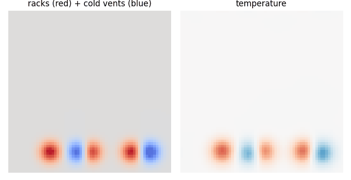
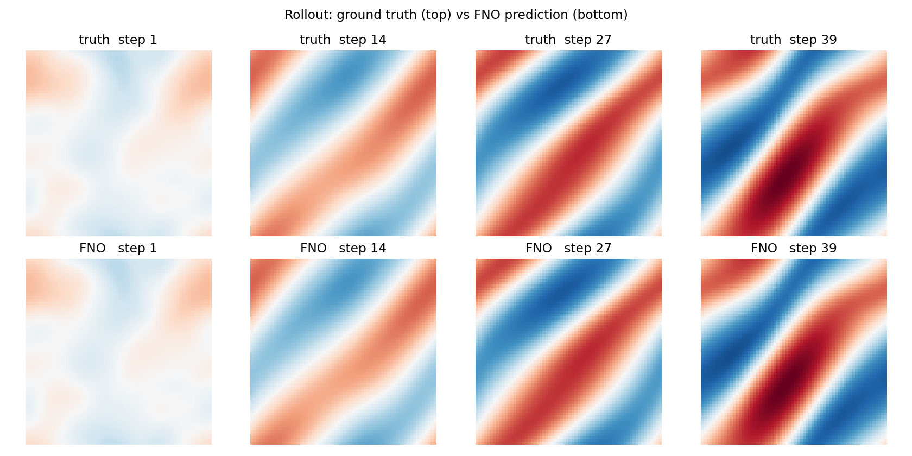
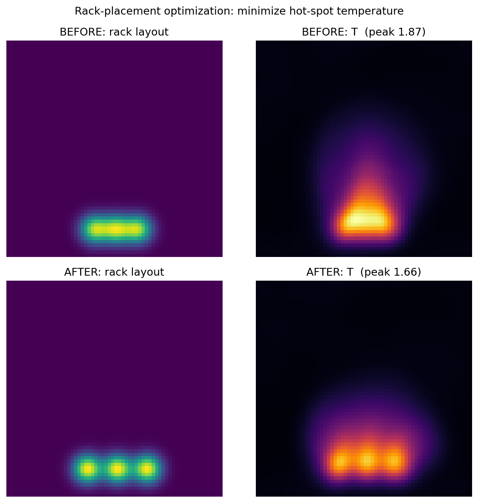
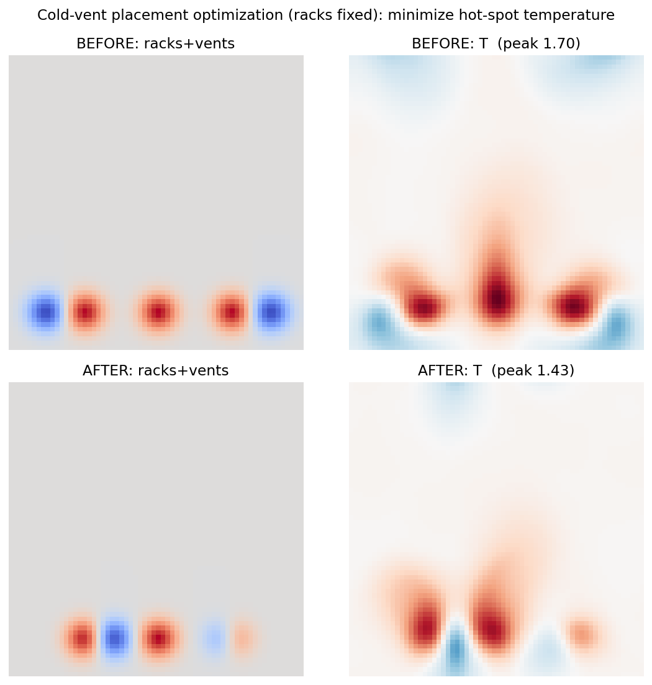

# Fourier Neural Operators for Data-Center Cooling Design

**A GPU spectral CFD solver → a Fourier Neural Operator surrogate → gradient-based cooling-layout optimization — built end-to-end.**

Learn a *fast, differentiable* model of buoyancy-driven data-center airflow, then use it to **automatically place cooling to minimize hot spots**.



*Hot air (red) rises off the fixed racks; cold air (blue) pools over the cold-aisle vents — a 2D Boussinesq simulation, learned by an FNO and used for design optimization.*

<sub>Python 3.10 · PyTorch 2.5 (CUDA 12.1) · single-GPU (built on an RTX 4050, 6 GB)</sub>

---

## What this is

A self-contained study that walks the full physics-ML pipeline:

| Stage | What it does | Result |
|---|---|---|
| **1. Spectral CFD solver** | GPU pseudo-spectral solver (2D Navier–Stokes → Boussinesq → data-center cooling) generates training data | ~2 min for 200 trajectories on GPU |
| **2. Neural operator** | A Fourier Neural Operator learns the PDE solution operator (built from scratch — spectral convolutions, the works) | one-step rel-L2 **0.24%** (Navier–Stokes) |
| **3. Rollout** | Autoregressive closed-loop prediction; honest error-vs-time analysis | stable for the forced case; chaotic drift diagnosed for the free case |
| **4. Design optimization** | The FNO is *differentiable*, so we backprop a temperature objective to the design variables | **–11.5%** peak temp (rack placement), **–15.7%** (cold-vent placement, racks fixed) |

The final artifact is a **differentiable design tool**: given a room, it finds where to place cooling so the racks stay cool — the "run more simulations, pull design insight out" pitch, made concrete.

---

## Highlights

- **Built the FNO from scratch** — spectral convolution, mode truncation, the lift/project structure — no `neuraloperator` black box.
- **GPU pseudo-spectral solver** for 2D incompressible Navier–Stokes (vorticity form) and Boussinesq convection, ~20–40× faster than the NumPy version.
- **Multi-field, conditioned operator**: predicts coupled `(vorticity, temperature)` and conditions on a **rack/vent layout map** fed as an input channel.
- **Differentiable inverse design**: gradient descent (with multi-start) through the trained FNO to optimize cooling layout.
- Honest evaluation throughout — including a diagnosed **chaotic rollout divergence** and how it was worked around.

---

## Results in pictures

**Neural operator matches the solver** (2D Navier–Stokes, autoregressive rollout — truth top, FNO bottom):



**Rack-placement optimization** — clustered racks make one merged hot spot; the optimizer spreads them (peak −11.5%):



**Cold-vent placement optimization** (the realistic case — racks are fixed, optimize the cooling):



---

## How it works

**1 — Data (spectral solver).** Everything linear (Laplacian, streamfunction, diffusion) is algebraic in Fourier space; the nonlinear advection is evaluated pseudo-spectrally (physical-space products, 2/3 dealiasing); time-stepped with Crank–Nicolson. Buoyancy is added as a source in the vorticity equation; racks/vents are Gaussian heat/cool sources on the floor.

**2 — FNO.** Lift the input fields (+ grid coords + layout map) to a hidden width, then 4 Fourier layers — each `GELU(SpectralConv2d(x) + Conv1×1(x))` — then project. The spectral conv keeps only the lowest Fourier modes and multiplies them by learned complex weights, which makes it a **global, resolution-invariant** convolution.

**3 — Rollout.** Seed with a few true frames, then predict autoregressively (feeding the model its own outputs), with the layout map held fixed.

**4 — Optimization.** Parameterize the layout by source positions → build the (differentiable) source map → predict a short thermal rollout → minimize a soft-max of the temperature (the hot spot) by gradient descent on the positions. Multi-start avoids local minima.

---

## Repository structure

```
.
├── data/                      # GPU spectral CFD data generators
│   ├── generate_ns_gpu.py         # 2D Navier-Stokes (vorticity)
│   ├── generate_boussinesq_gpu.py # + temperature + buoyancy
│   ├── generate_cooling_gpu.py    # + heated racks
│   └── generate_aisle_gpu.py      # hot-aisle/cold-aisle (racks + cold vents)
├── fno/                       # the neural operator + pipeline
│   ├── spectral_conv.py           # SpectralConv2d — the core FNO layer
│   ├── fno2d.py / fno2d_cool.py   # FNO models (single- / multi-field + conditioning)
│   ├── dataset*.py, losses.py     # windowing, per-channel normalization, LpLoss
│   ├── train*.py                  # training loops
│   ├── rollout*.py                # autoregressive rollout evaluation
│   ├── optimize_cool.py           # rack-placement optimizer
│   └── optimize_aisle.py          # cold-vent optimizer (fixed racks, multi-start)
├── animate.py                 # renders figures/cooling.gif
├── figures/                   # result figures + animation
├── requirements.txt
└── README.md
```

*(Datasets `*.npz` and checkpoints `*.pt` are git-ignored — regenerate them with the scripts.)*

---

## Reproduce

```bash
# 0. environment (Python 3.10, a CUDA GPU)
python -m venv env && source env/bin/activate
pip install -r requirements.txt

# 1. generate the hot-aisle/cold-aisle dataset (~2-4 min on GPU)
cd data && python generate_aisle_gpu.py --ntraj 200 --T 15 --preview --out aisle_64.npz && cd ..

# 2. train the rack/vent-conditioned FNO (~5 min)
cd fno && python train_cool.py --data ../data/aisle_64.npz --epochs 50 --out aisle_fno.pt --metrics aisle_metrics.json

# 3. evaluate the rollout
python rollout_cool.py --data ../data/aisle_64.npz --ckpt aisle_fno.pt

# 4. optimize cold-vent placement (racks fixed)
python optimize_aisle.py --ckpt aisle_fno.pt --data ../data/aisle_64.npz

# (animation)
cd .. && python animate.py --data data/aisle_64.npz --out figures/cooling.gif
```

The Navier–Stokes and Boussinesq stages follow the same pattern (`generate_*_gpu.py` → `train*.py` → `rollout*.py`).

---

## Honest notes & limitations

- **Rollout drift.** One-step accuracy is excellent, but *free* (unforced) convection is chaotic, so long autoregressive rollouts decorrelate from the exact trajectory (physically plausible fields, but pointwise error grows). The design optimizer therefore uses the **short-horizon** prediction, where hot-spot *locations* (tied to the layout) are reliable. A known fix is rollout-stabilized ("pushforward") training.
- **2D & idealized.** A 2D cross-section with Gaussian sources — captures the buoyant-plume structure, not a full 3D CRAC/containment model. The pipeline extends to 3D and to a geometry-aware solver.
- **Surrogate accuracy.** Optimization results are directional (the FNO carries ~8–10% error on the turbulent cooling case).

---

## References

- Li et al., *Fourier Neural Operator for Parametric PDEs*, ICLR 2021.
- Boussinesq convection / pseudo-spectral methods (standard CFD).

*Built as an exploration of physics-ML: neural-operator surrogates + differentiable design optimization.*
